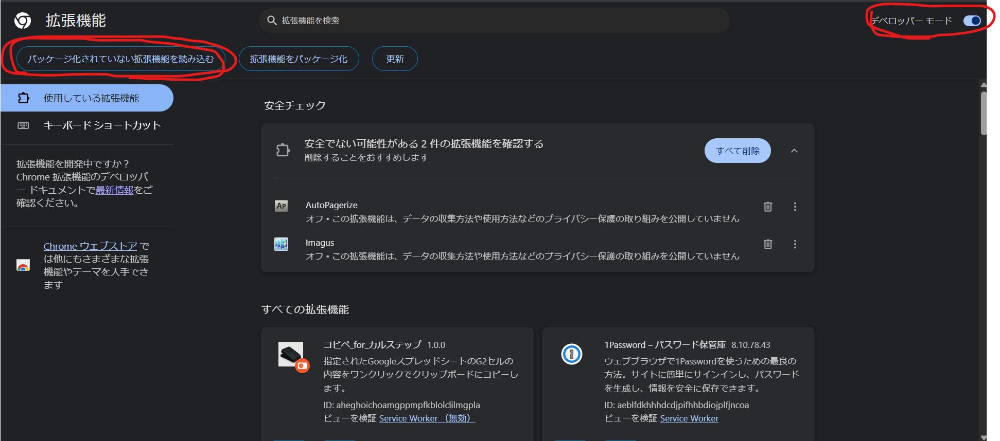
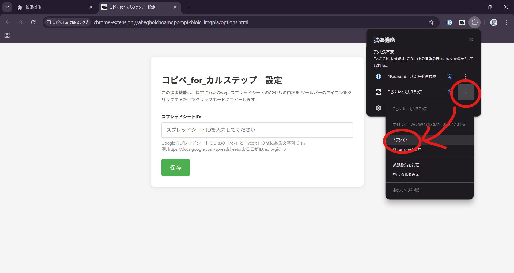
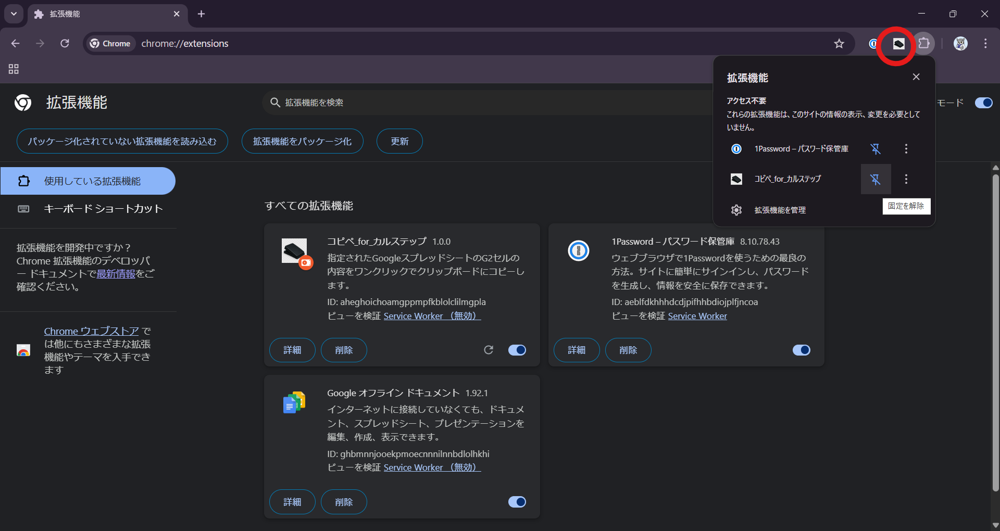

# コピペ_for_カルステップ 導入マニュアル（テストユーザー様向け）

この度は、「コピペ_for_カルステップ」拡張機能の先行テストにご協力いただき、誠にありがとうございます。
このマニュアルは、Chromeウェブストアでの公開前に、テスト版の拡張機能をご自身のChromeブラウザに導入し、利用を開始するための手順書です。

## 1. 準備

まず、カルステップ運営から共有された **`karustep-copy-paste.zip`** という名前のZipファイルをダウンロードしてください。

ダウンロードURL：　[https://xgf.nu/8dFfy](https://xgf.nu/8dFfy)

> **[重要] 保存場所に関する注意**
> 
>この後、ダウンロードしたZipファイルを解凍して拡張機能をインストールしますが、インストール後に**解凍先のフォルダを移動したり、名前を変更したり、削除したりすると、拡張機能が動作しなくなります。**
> そのため、ダウンロードする際は、**デスクトップなど一時的な場所ではなく、初めから「ドキュメント」フォルダの中など、今後動かす予定のない安定した場所**に保存することをお勧めします。

---

## 2. インストール手順

以下の手順に沿って、拡張機能をChromeにインストールします。

### ステップ1：Zipファイルを解凍する
ダウンロードした **`karustep-copy-paste.zip`** ファイルを右クリックし、「すべて展開」を選択してください。同じ場所に新しいフォルダが作成されます。
> **[重要]** この後Chromeで選択するのは、この**新しく作成されたフォルダ**です。Zipファイルのままでは読み込めません。

### ステップ2：Chromeの拡張機能ページを開く
Chromeブラウザを開き、アドレスバーに以下の文字列をコピー＆ペーストして、Enterキーを押します。

**`chrome://extensions`**

### ステップ3：デベロッパーモードを有効にする
拡張機能管理ページの右上にある**「デベロッパー モード」**というスイッチをクリックして、オン（有効）にしてください。スイッチが青色に変わります。

### ステップ4：拡張機能を読み込む
デベロッパーモードを有効にすると、左上に**「パッケージ化されていない拡張機能を読み込む」**というボタンが表示されます。このボタンをクリックしてください。

### ステップ5：フォルダを選択する
ファイル選択ウィンドウが開きますので、**ステップ1で解凍した新しいフォルダ**を選択し、「フォルダーの選択」ボタンを押してください。

### ステップ6：インストール完了とアイコンの固定
一覧に「コピペ_for_カルステップ」というカードが表示されれば、インストールは成功です。
最後に、ブラウザのツールバー右上の**パズルのピース型アイコン**をクリックし、「コピペ_for_カルステップ」の横にある**ピンのアイコン**をクリックしてください。これで、ツールバーに常にアイコンが表示されるようになります。

---

## 3. 初期設定

インストールしただけでは、どのスプレッドシートからコピーするのか指定できていません。そこで一度だけ、以下の初期設定が必要です。

1.  ツールバーに新しく表示された「コピペ_for_カルステップ」のアイコンを**右クリック**し、「**オプション**」を選択します。
2.  設定ページが開きますので、テキストボックスに、コピー対象となる**GoogleスプレッドシートのID**を貼り付けます。
3.  **「保存」**ボタンをクリックします。「設定を保存しました」というメッセージが表示されれば、設定完了です。

---

## 4. 使い方

設定完了後、使い方は非常にシンプルです。

1.  ツールバーにある「コピペ_for_カルステップ」のアイコンを**（左）クリック**します。
2.  アイコンに「...」と表示された後、緑色の「OK!」というバッジが一瞬表示されます。
3.  これで、出力の内容がクリップボードにコピーされました。メモ帳や他のアプリケーションで貼り付け（`Ctrl + V`）を試してみてください。

**備考**
*   アイコンクリックからコピーまでに2秒ほどかかります。
*   スプレッドシートは開いていなくても、アイコンをクリックすれば最新の出力をコピーします。

テストへのご協力、重ねて感謝申し上げます。何かご不明な点がございましたら、お気軽にお知らせください。